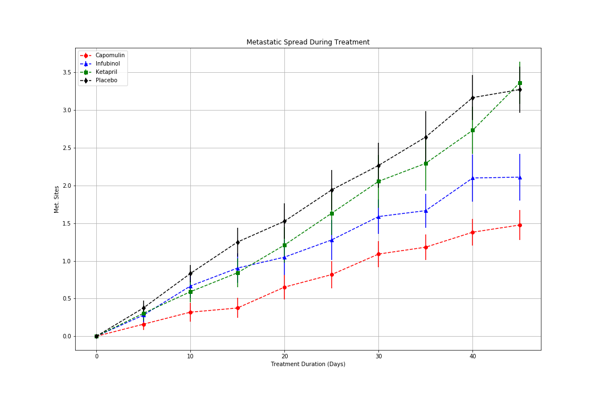
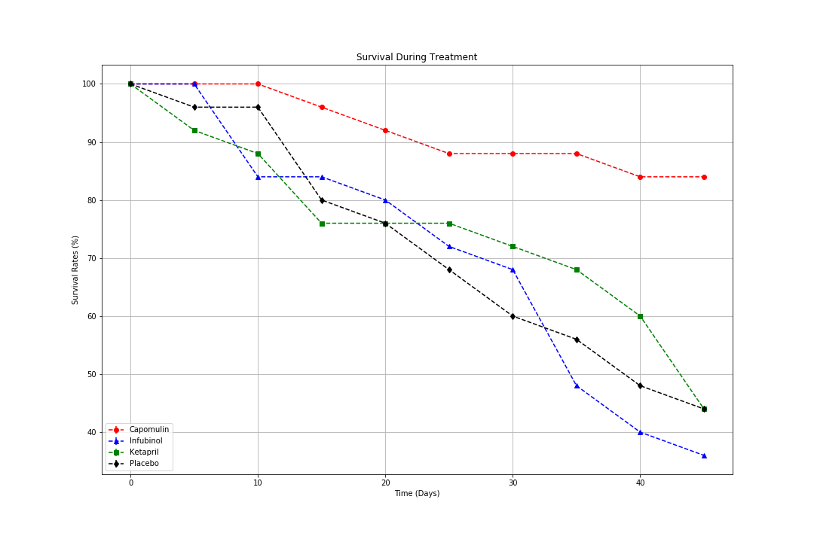
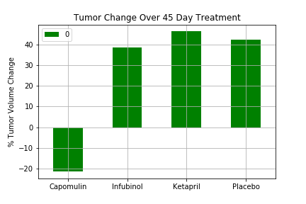
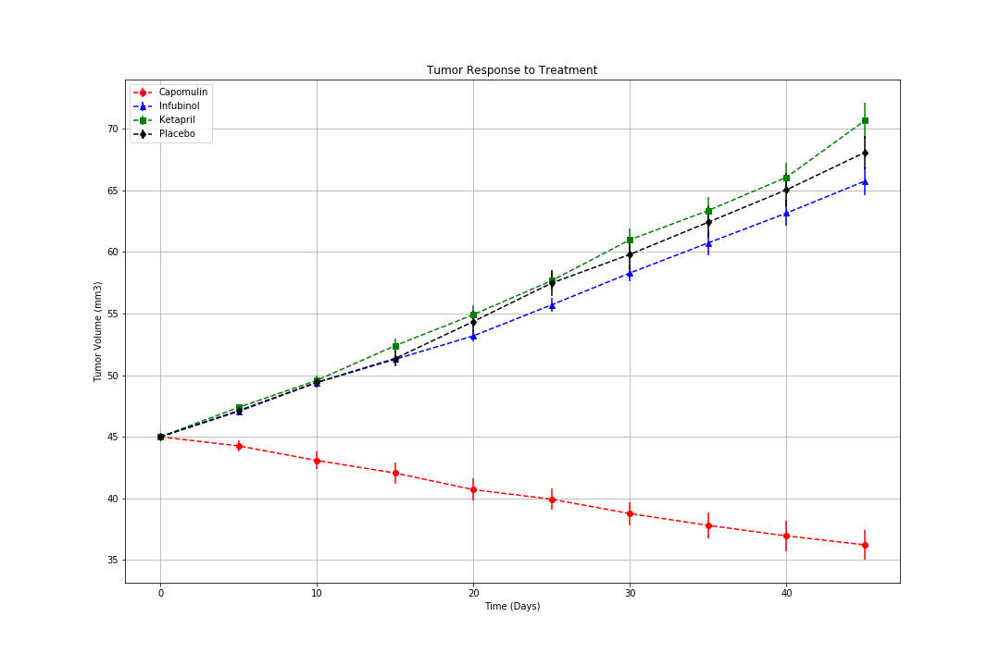

# The Power of Plots

## Background

## Pymaceuticals Inc

In this work, I am analyzing the pharmaceutical data [data](https://github.com/ofunkey/Matplotlib/blob/masterPymaceuticals/data) for potential treatments to squamous cell carcinoma (SCC), a commonly occurring form of skin cancer.
250 mice were treated through a variety of drug regimes over the course of 45 days. Their physiological responses were then monitored over the course of that time. The objective is to analyze the data to show how four treatments (Capomulin, Infubinol, Ketapril, and Placebo) compare.

Tasks include :

* Creating a scatter plot that shows how the tumor volume changes over time for each treatment.
* Creating a scatter plot that shows how the number of [metastatic](https://en.wikipedia.org/wiki/Metastasis) (cancer spreading) sites changes over time for each treatment.
* Creating a scatter plot that shows the number of mice still alive through the course of treatment (Survival Rate)
* Creating a bar graph that compares the total % tumor volume change for each drug across the full 45 days.

Finally:

* A written description of three observavable trends based on the data

